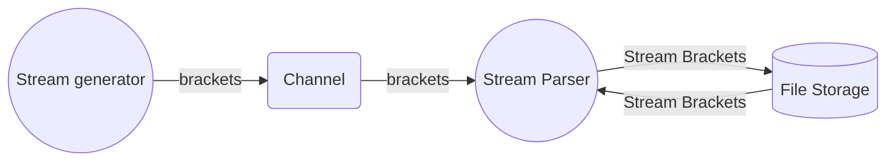

# Overview
This code is an attempt to solve the valid paranthesis problem, but, in this case, for a stream rather than a string:

> Given a stream of characters consisting of brackets open brackes '(', '{', '[' and corresponding closing brackets']', determine if/at which point the stream has produced a valid sequence of open and close brackets or not. The size of the data stream is not known ahead of time.

For example, consider the following stream of brackets:

```
[[[[]]]]
```
We consider this valid as each open bracket '[' has a corresponding ']' closing bracket. Here's another valid example:

```
[[[{{{((()))}}}]]]
```

Now consider:

```
[]]]
```

We'll find one valid pair, "[]", however, afterwards, the stream becomes invalid as there are too many closing brackets, "]".

Since the stream could be enormous, pulling the data into memory poses a problem.

# Idea 1 - Read and Write brackets to a File Stream
The first issue that comes to mind is how do we store the data? Since the data can be of an arbitrary size, buffering it all into memory is most likely too risky - what if someone sends us a gigabyte of open brackets? How about 4 gigabytes of open bracket? We can run into potential problems of exhausting memory by storing them on an in memory data structure.

Instead of storing the data in memory, perhaps they can be streamed out to something tried and true: a log file stream. In this case, we aren't limited by RAM and can deal with much larger quantities of data. The overall flow of data looks like the following:



The "[stream generator](https://github.com/philip-3000/valid-bracket-stream-processor/blob/e8bb3b5a1fdb5033f06ad507b8696ba405c48d46/main.go#L167)" is a simple go routine that will push brackets over a channel to a "[stream parser](https://github.com/philip-3000/valid-bracket-stream-processor/blob/e8bb3b5a1fdb5033f06ad507b8696ba405c48d46/main.go#L83)" go routine. The parser will append open brackets such as '{', '[' and '(' to the file stream and keep an offset into the stream.  When a closing bracket such as '}', ']', or ')' comes into the stream, the offset will be used to read the last character back and verify the brackets match. 

The offset is then decremented so we know the next position in the stream to read from. We also can increment a total byte counter to keep track of how but the data stream is.  A few conditions to check:

 * if there's a closing bracket that comes in, but, the offset is 0, we've either not pushed any open brackets on to the stream, or, we've exhausted all of them. This means the stream is not valid.
 * if the character coming in over the channel to the parser is not an open or close bracket, ignore it.
 * if we find a match on the bracket and we've read our offset down to 0, we've produced a valid stream. We can print out an indiciation that this is the case.

 For simplicity of this initial version, individual characters are written to and read from the stream. 

**Note:** the process of writing one byte a time to the file stream is very inefficient, but, it is being used to illustrate the concept. A potential fix to this would be buffered i/o. We can make this improvement as a "take 2".

To run: 

```bash
go run main.go
Running a few tests:
	 * Generate a small valid bracket stream
	 * Generate a valid bracket stream of > 1MB of characters
	 * Generate an invalid bracket stream of not enough open brackets
	 * Generate another small valid bracket stream
	 * Generate a larger valid bracket stream over 256MB of characters

Press ctrl+c to continue...
First test...
*****Found a valid bracket stream! Total bracket count = 4
Second test...
*****Found a valid bracket stream! Total bracket count = 2097152
Third test...
*****Found a valid bracket stream! Total bracket count = 1014
*****Invalid Stream: Exhausted offset - cannot read anymore open brackets from stream.
*****Invalid Stream: Exhausted offset - cannot read anymore open brackets from stream.
*****Invalid Stream: Exhausted offset - cannot read anymore open brackets from stream.
*****Invalid Stream: Exhausted offset - cannot read anymore open brackets from stream.
*****Invalid Stream: Exhausted offset - cannot read anymore open brackets from stream.
Fourth test...
*****Found a valid bracket stream! Total bracket count = 4096
Fifth test...
*****Found a valid bracket stream! Total bracket count = 134217728

Tests Complete.  Control-C to quit.
```

The first few test cases will be completed fairly quickly..however the last one will take quite a while. Better go make some coffee...perhaps run errands.

