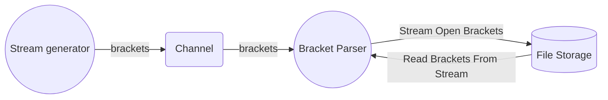

# Overview
This code is an attempt to solve the valid paranthesis problem, but, in this case, for a stream rather than a string:

> Given a stream of characters consisting of brackets '[' and ']', determine if/at which point the stream has produced a valid sequence of open and close brackets or not. The size of the data stream is not known ahead of time.

For example, consider the following stream of brackets:

```
[[[[]]]]
```
We consider this valid as each open bracket '[' has a corresponding ']' closing bracket. Now consider:

```
[]]]
```

We'll find one valid pair, "[]", however, afterwards, the stream becomes invalid as there are too many closing brackets, "]".

Since the stream could be enormous, pulling the data into memory poses a problem.

# Idea 1 - Utilizing a File Stream
Instead of storing the data in memory, perhaps they can be streamed out to a log file. In this case, we aren't limited by RAM and can deal with much larger quantities of data. The overall flow of data looks like the following:



The stream generator go routine will push brackets over a channel to a stream parser go routine - the parser will append open brackets '[' to the stream and keep an offset into the stream.  When a closing bracket ']' is enclosded, the offset will be used to read the last character back and verify the brackets match. 

In this case, we are only limited by the storage capacity on the machine. 

**Note:** the process of writing one byte a time to the file stream is very inefficient, but, it is being used to illustrate the concept. A potential fix to this would be buffered i/o. 

To run: 

```bash
go run main.go
```

The first few test cases will be completed fairly quickly..however the last one will take quite a while. Better go make some coffee...perhaps run errands.

