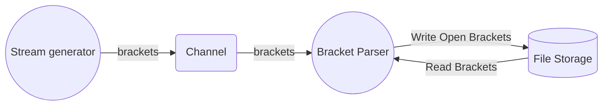

# Overview
This code is an attempt to solve the valid paranthesis problem, but, in this case, for a stream rather than a string:

> Given a stream of characters consisting of brackets '[' and ']', determine if/at which point the stream has produced a valid sequence of open and close brackets or not. The size of the data stream is not known ahead of time.

For example, consider the following stream of brackets:

```
[[[[]]]]
```
We consider this valid as each open bracket '[' has a corresponding ']' closing bracket. Now consider:

```
[]]]
```

We'll find one valid pair, "[]", however, afterwards, the stream becomes invalid as there are too many closing brackets, "]".

Since the stream could be enormous, pulling the data into memory poses a problem.

# Idea 1 - Utilizing a File Stream
Instead of storing the data in memory, perhaps they can be streamed out to a log file. In this case, we aren't limited by RAM and can deal with much larger quantities of data. The overall flow of data looks like the following:



The "stream generator" is a simple go [routine](https://github.com/philip-3000/valid-bracket-stream-processor/blob/87339335a4a718894496c68b5de7561706079a9d/main.go#L146) that will push brackets over a channel to a "stream parser" go [routine](https://github.com/philip-3000/valid-bracket-stream-processor/blob/87339335a4a718894496c68b5de7561706079a9d/main.go#L76). The parser will append open brackets '[' to the stream and keep an offset into the stream.  When a closing bracket ']' comes into the stream, the offset will be used to read the last character back and verify the brackets match. 

The offset is then decremented so we know the next position in the stream to read from. We also can increment a total byte counter to keep track of how but the data stream is.  A few conditions to check:

 * if there's a closing bracket that comes in, but, the offset is 0, we've either not pushed any open brackets on to the stream, or, we've exhausted all of them. This means the stream is not valid.
 * if the character coming in over the channel to the parser is not an open or close bracket, ignore it.
 * if we find a match on the bracket and we've read our offset down to 0, we've produced a valid stream.

In this case, we are only limited by the storage capacity on the machine. 

**Note:** the process of writing one byte a time to the file stream is very inefficient, but, it is being used to illustrate the concept. A potential fix to this would be buffered i/o. 

To run: 

```bash
go run main.go
```

The first few test cases will be completed fairly quickly..however the last one will take quite a while. Better go make some coffee...perhaps run errands.

